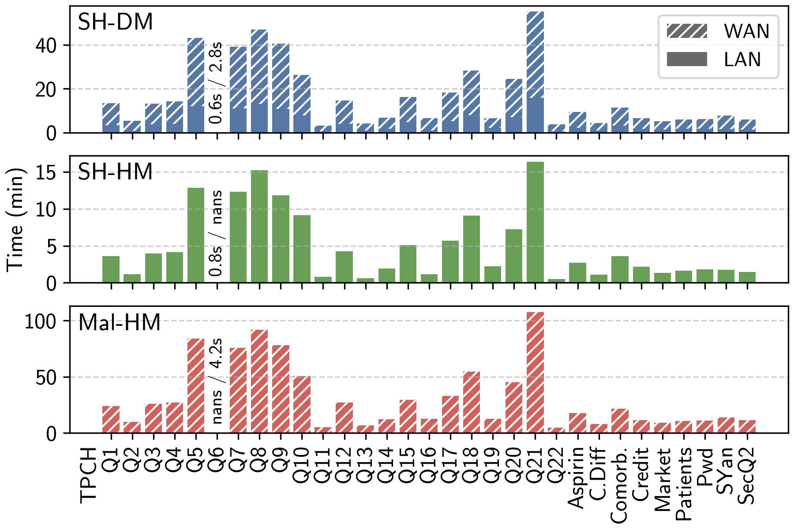
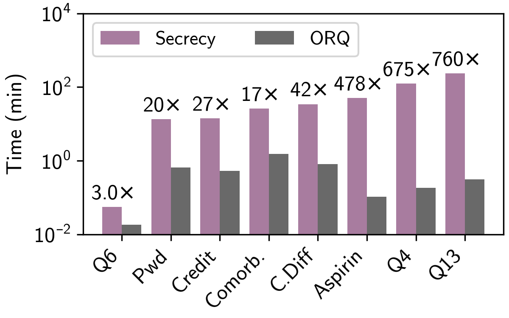
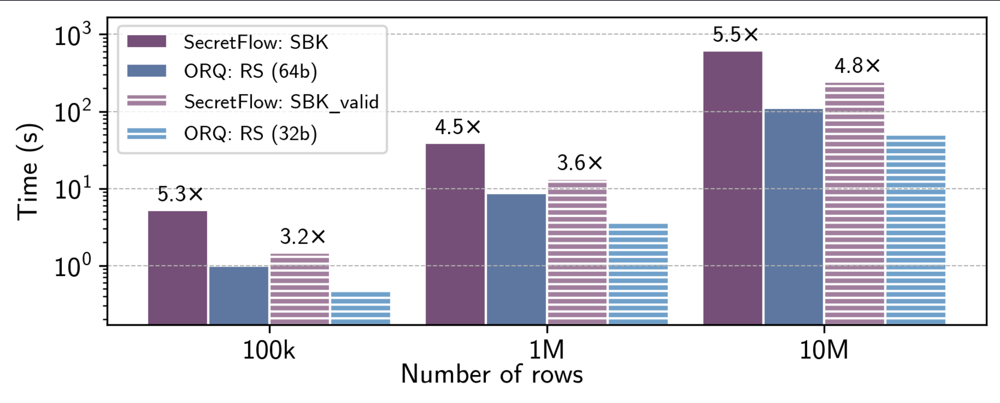
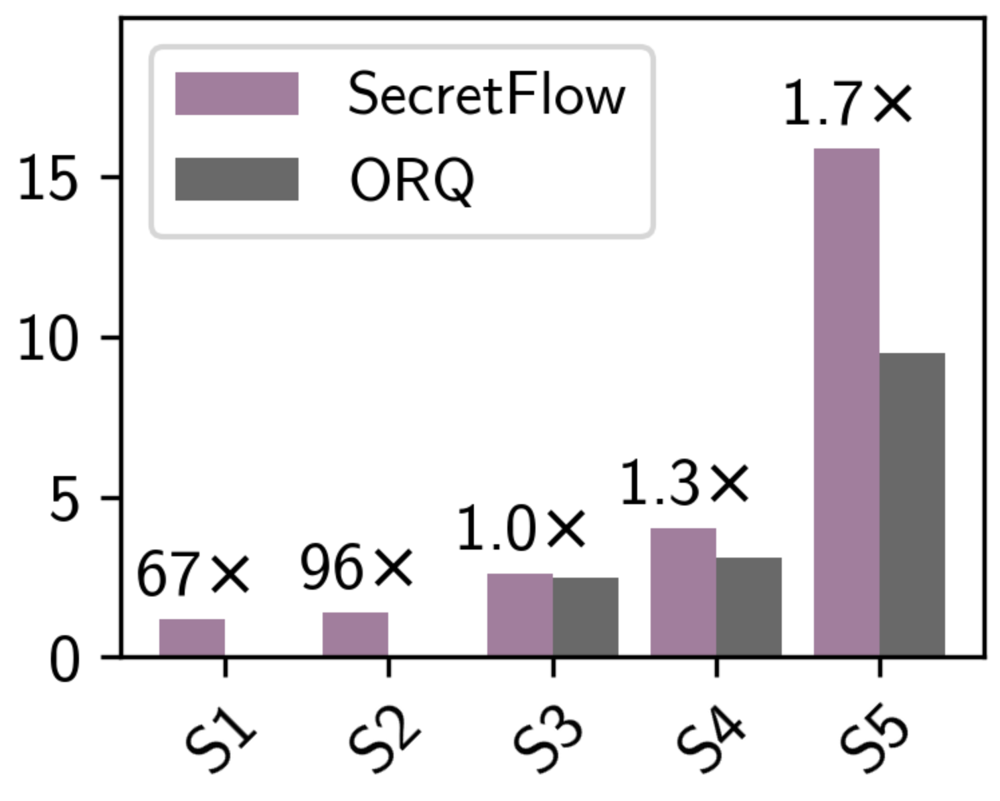
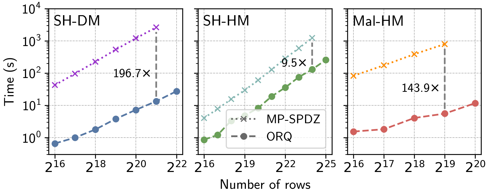
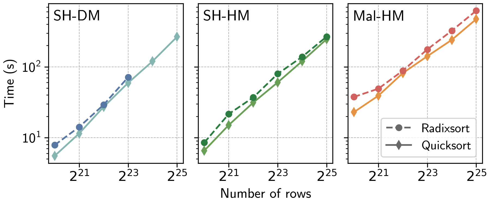

# Reproducibility Instructions

## Overview

We target all three artifact badges:
- [Available](#available): we publish ORQ on [Github](https://github.com/CASP-Systems-BU/orq), and once reviewers are otherwise satisfied, will publish to Zenodo.
- [Functional](#functional): we describe all artifact components and provide instructions for running a minimal working example.
- [Reproduced](#reproduced): we provide instructions for reviewers to reproduce key results of Section 5 of the paper. Our main results -- Figures 4, 5, 6 and 7 -- are reproducible. Figure 10 is also reproducible but is optional.

We run all experiments on `c7a.16xlarge` AWS instances with Ubuntu 22.04.5
LTS and gcc 11.4.0.

Here we summarize the experiments outlined in this document, including their approximate running time.
- TPC-H and other queries (Figure 4), 3-45 hours (flexible)
- Comparison with Secrecy (Figure 5a), 8.5 hours
- Comparison with SecretFlow queries (Figure 5b), 3 hours
- Comparison with SecretFlow sorting (Figure 6), 2 hours
- Comparison with MP-SPDZ sorting (Figure 7), 1 day
- (Optional) ORQ sorting (Figure 10), 5-36 hours

In total, we expect the experiments to take between 41 hours and 119 hours (approximately 5 days). If needed, we can set up additional clusters to run experiments in parallel. Our scripts also enable running subsets of the queries that the evaluators can choose if they would like.

## Getting Started

We will provide AWS access information (SSH keypairs and IP addresses) on HotCRP.

> [!IMPORTANT]
> All experiments run on AWS. To simplify artifact evaluation, we are providing reviewers with an AWS environment:
> * Access information to the AWS clusters (SSH keypairs, IP addresses) is availalbe on HotCRP. *Please do not share them outside the AEC*.
> * Remember to freeze or turn off the cluster when you're done, as this evaluation is expensive! If you do not know how, ask us via HotCRP—thank you!

From your local machine, SSH into the AWS cluster and start a tmux session. A helpful `tmux` reference is available [here](https://tmuxcheatsheet.com/).

```bash
$ ssh ubuntu@[CLUSTER-IP]
# run tmux and clone the repo
$ tmux
$ git clone https://github.com/CASP-Systems-BU/orq
$ cd orq
# if you are returning after the first time, you can simply run `tmux -a`
```

To _detach_ from a running `tmux` session, press `Ctrl-b D`.

Let us know when you are done testing (or just taking a break) so we can pause instances. Reach out to us on HotCRP with any questions.

## Available

_Time: 5 minutes_

ORQ is available on [Github](https://github.com/CASP-Systems-BU/orq), and it will be available on Zenodo once the reviewers are satisfied.

ORQ is licenced with the AGPLv3 license ([here](https://github.com/CASP-Systems-BU/orq/blob/main/LICENSE)), an open source license which allows comparison and extension.

ORQ has a [README file](https://github.com/CASP-Systems-BU/orq/blob/main/README.md) that references the SOSP'25 paper.

## Functional

_Time: 10 minutes_

We begin by giving a description of each artifact component and its relation to the paper. All code for ORQ is contained in our public repository. Important components to highlight:
- `scripts/`
    - `sosp25`: all scripts for reproducing our experiments
    - `orchestration/aws`: scripts for launching an AWS cluster (we have run this for you)
- `include/`: our main framework, including
    - `core/communication/no_copy_communicator`: our custom communication layer
    - `core/operators`: implementations of oblivious operators, including oblivious quicksort, radixsort, and shuffle
    - `core/protocols`: implementations of secure multiparty computation protocols: 2PC [SH-DM], 3PC [SH-HM], and 4PC [Mal-HM]
    - `relational/database`: the oblivious analytics subsystem for tabular data
    - `service/common`: the backend of our framework, including our data-parallel vectorized runtime.
- `src/`: source code for all queries profiled in ORQ
- `tests/`: a test suite for our framework

We run all experiments on `c7a.16xlarge` AWS instances with Ubuntu 22.04.5 LTS and gcc 11.4.0. No part of the system deliberately performs malicious or destructive operations.

We include a comprehensive list of dependencies in the repository's [main README](https://github.com/CASP-Systems-BU/orq/blob/main/README.md). All dependencies are installed by our main setup and deployment scripts (described below). If you wish to install dependencies manually, see further instructions in the [main README](https://github.com/CASP-Systems-BU/orq/blob/main/README.md).

### Minimal Working Example

In this section we give instructions for running a single query. To begin, we need to run a deployment script to connect all servers. To run a one-time setup across all nodes in the system, execute the deployment script as follows.

```bash
$ cd ~/orq/
$ ./scripts/orchestration/deploy.sh ~/orq/ node0 node1 node2 node3
```

> [!warning]
>
> Failure to deploy (by running the deploy script) will cause issues. Most experiments in the reproducible section automatically deploy, and those that do not are clearly labeled.

To compile and run the example query, execute the following commands on the AWS cluster:

```bash
$ cd ~/orq/build
$ ../scripts/query-experiments.sh tpch 0.1 3 16 lan 13..13
```

This command will run `tpch` query `13` at scale factor `0.1`, under the `3PC` protocol (SH-HM) with `16 threads`. (Watch out for the trailing `..13`. It is required.)

You should see output that looks something like this:

```
node0                                                                    [42/53]
Checking node2 => 172.31.20.108 => enp55s0                                      
Error: Cannot delete qdisc with handle of zero.                                 
Disabled WAN on enp55s0...                                                      
wan-sim.py                                    100% 1967     9.3MB/s   00:00     
Error: Cannot delete qdisc with handle of zero.                                 
Checking node0 => 172.31.18.79 => enp55s0                                       
Disabled WAN on enp55s0...                                                      
node0                                                                           
Checking node3 => 172.31.25.208 => enp55s0                                      
Error: Cannot delete qdisc with handle of zero.                                 
Disabled WAN on enp55s0...                                                      
wan-sim.py                                    100% 1967     8.6MB/s   00:00     
Error: Cannot delete qdisc with handle of zero.                                 
Checking node0 => 172.31.18.79 => enp55s0                                       
Disabled WAN on enp55s0...                                                      
PING node1 (172.31.29.51) 56(84) bytes of data.                                 
                                                                                
--- node1 ping statistics ---                                                   
3 packets transmitted, 3 received, 0% packet loss, time 2046ms                  
rtt min/avg/max/mdev = 0.205/0.228/0.248/0.017 ms                               
                                                                                
PING node2 (172.31.20.108) 56(84) bytes of data.                                
                                                                                
--- node2 ping statistics ---                                                   
3 packets transmitted, 3 received, 0% packet loss, time 2046ms                  
rtt min/avg/max/mdev = 0.190/0.194/0.201/0.004 ms                               
                                                                                
PING node3 (172.31.25.208) 56(84) bytes of data.                                
                                                                                
--- node3 ping statistics ---                                                   
3 packets transmitted, 3 received, 0% packet loss, time 2046ms                  
rtt min/avg/max/mdev = 0.170/0.196/0.221/0.020 ms                               
                                                                                
Query q13 | Scale Factor 0.1 | Protocol 3 | Threads 16                          
                                                                                
Common interface: enp55s0; subnet 172.31.18.79/20                               
Compiler flags: -O3 -g -pthread -D PROTOCOL_NUM=3 -mbmi -march=native -DCOMMUNIC
ATOR_NUM=NOCOPY_COMMUNICATOR -D NOCOPY_COMMUNICATOR_THREADS=4                   
-- Configuring done                                                             
-- Generating done                                                              
-- Build files have been written to: /home/ubuntu/orq/build         
[  0%] Built target print_4pc_info                                              
Consolidate compiler generated dependencies of target q13
[100%] Built target q13
==== 0.1 SF; 16 threads ====
NoCopyComm | Communication Threads: 4
Q13 SF 0.1
C size: 15000
O size: 150000
[=SW]            Start
[ SW]           Filter 0.01778  sec
[ SW]       outer join 12.52    sec
[ SW]     Distribution 11.93    sec
[ SW]       Final sort 12.99    sec
[=SW]          Overall 37.46    sec
30 rows OK
```

The first half of the output is just network configuration (specifically, confirming that the WAN simulator is not running; the `qdisc` errors are expected and safe to ignore). Query execution begins on the line `==== 0.1 SF; 16 threads ====`. The output `30 rows OK` signifies that ORQ's output from the oblivious execution was compared against a plaintext (SQLite) execution and matched.

<details>
<summary>(Optional) Running an Example Locally (without AWS access)</summary>

If the reviewer wishes to run an example on a local machine where each party is run in a separate process, run the following commands after cloning the repository. We emphasize that this is not required, but we present it as an option to demonstrate the functionality of the repository.

```bash
cd orq/
mkdir build
cd build/
# run the setup script
../scripts/setup.sh
# make the target
cmake .. -DPROTOCOL=3
make q1  # or any other query
# runs TPC-H Q1 with 1 thread at Scale Factor 0.01 (takes about a minute)
startmpc -n 3 ./q1
```

> Note: The setup procedure assumes that we have `apt` as a package manager (e.g., Ubuntu). While the above steps may work in additional environments, they have not been thoroughly tested. Additionally, the default nocopy communicator may cause problems if running on MacOS.

</details>

## Reproduced

Each subsection below describes how to run and obtain results for a single experiment. Each experiment either contains a single script or one script for ORQ and one for the competitor system. The experiments can be run in any order, and running the same experiment multiple times will not cause any issues. All scripts that require additional arguments clearly document the arguments and provide a reasonable default argument if one exists.

Each experiment additionally contains a script to plot the results in a manner that closely matches the paper's figures. We include an example of a reasonable output plot, although exact details may vary depending on whether you choose to run the full experiment or a subset of the experiment.

> Note: You will need additional clusters to run the SecretFlow experiments, as we have observed that the setup for the two Secretflow experiments can interfere with one another and can occasionally interfere with ORQ and skew results.

> [!warning]
>
> These experiments take a long time: a few hours up to a few days to run all experiments. You should use a terminal multiplexer such as `tmux` or `screen` to prevent your SSH connection from dropping and killing the experiment. We provide instructions below using `tmux`; a helpful reference is available [here](https://tmuxcheatsheet.com/). The scripts allow the evaluator to run a subset of queries in some experiments to decrease the amount of time required.

### 1) TPC-H & other queries (Fig. 4)

_Time: 3-45 hours (flexible)_

If you wish to reproduce the entirety of the TPC-H experiments, use the following commands. We emphasize that the following runs _all_ queries in _all_ settings, which you may not wish to do in the interest of time.

```bash
$ cd ~/orq
# specify protocol (2, 3, or 4) and network environment (lan or wan)
# 2 = SH-DM
# 3 = SH-HM
# 4 = Mal-HM
# any of the following commands can be skipped in the interest of time
$
# two party lan and wan
$ ./scripts/sosp25/artifact-tpch.sh 2 lan # ~ 3.5 hr
$ ./scripts/sosp25/artifact-tpch.sh 2 wan # ~ 9 hr
$
# three party lan and wan
$ ./scripts/sosp25/artifact-tpch.sh 3 lan # ~ 3 hr
$ ./scripts/sosp25/artifact-tpch.sh 3 wan # ~ 6.5 hr
$
# four party lan and wan
$ ./scripts/sosp25/artifact-tpch.sh 4 lan # ~ 6.5 hr
$ ./scripts/sosp25/artifact-tpch.sh 4 wan # ~ 16 hr
$
# once you've run the experiments you want to run, generate a plot
$ ./scripts/sosp25/artifact-tpch.sh plot
```

The full experiments take a long time. We estimate that running all 31 queries end-to-end takes, approximately:

|              |   LAN  |   WAN  |
| ------------ | -----: | -----: |
| 2PC (SH-DM)  | 3.5 hr | 9   hr |
| 3PC (SH-HM)  | 3   hr | 6.5 hr |
| 4PC (Mal-HM) | 6.5 hr | 16  hr |

You do not need to run all experiments to generate a partial plot. The plotting script can be re-run any time, and will ingest any new data generated. Here is an example of the output that is produced if we run the script for two parties in LAN and WAN, for three parties in LAN (skipping 3PC WAN), and for four parties in WAN (skipping 4PC LAN):



> Note: Reproducing the entirety of Figure 4 would take around 45 hours. We have added support for optionally running only a _subset_ of the TPC-H queries. You can specify either a list of a range of queries as the optional final argument to the script:
>
> ```bash
> # run queries Q1, Q9, and Q17 in 3PC LAN
> $ ./scripts/sosp25/artifact-tpch.sh 3 lan 1,9,17
> # run queries Q8 through Q15 in 2PC WAN
> $ ./scripts/sosp25/artifact-tpch.sh 2 wan 8..15
> ```
> 
> Note that when running a subset of TPC-H queries, we still run all `Other` queries, since these complete quickly, even in the slowest setting.

### 2) Comparison with Secrecy (Fig. 5a)

_Time: 8.5 hours_

> [!Warning]
>
> If this is the first experiment you run, and you did not run the `deploy.sh` script in the [Functional section](#functional), do so now.

To replicate the Secrecy comparison, run the script for both Secrecy and ORQ:

```bash
$ cd ~/orq
# Run secrecy queries and collect data
$ ./scripts/sosp25/secrecy/run_secrecy.sh
# Run ORQ queries and collect data
$ ./scripts/sosp25/secrecy/run_orq.sh
# Generate Plot
$ ./scripts/sosp25/secrecy/plot_comparison.py
```

The output plot is placed in `scripts/sosp25/secrecy/`.

The Secrecy experiments take a long time (**8+ hours**). ORQ will take about five minutes. The output plot will look like this:

> Note: due to the large speedups of ORQ compared to Secrecy on some complex queries, the exact ratios may differ slightly.

Here is an example plot from this experiment:



### 3) Comparison with SecretFlow

The comparison with Secretflow involves two experiments: `Sorting` and `TPC-H queries`. 
> [!Warning]
> 
> These experiments must be run on __two independent clusters__ to avoid SecretFlow setup conflicts. We will provide dedicated clusters for this experiment on HotCRP. For each of the two experiments, both ORQ and SecretFlow will be run on the same cluster to avoid the need to copy data between clusters.
>
> If this is the first experiment you run, and you did not run the `deploy.sh` script in the [Functional section](#functional), do so now.

#### Sorting (Fig. 6)

_Time: 2 hours_

The sorting experiment can be run using the following commands:
```bash
cd ~/orq

# Runs the complete experiment for both systems
./scripts/sosp25/secretflow/artifact-secretflow-sort.sh

# Once the experiments are complete, this command can be used to generate plots
./scripts/sosp25/secretflow/artifact-secretflow-sort.sh plot
```
The raw result along with the generated plot will be available in the `~/orq/results/secretflow-sort` directory once the above commands have been run. Here is an example plot from this experiment:



#### Queries (Fig. 5b)

_Time: 3 hours_

The comparison with SecretFlow on queries can be run using the following commands:
```bash
cd ~/orq

# [This setup should only be run once] Run setup for secretflow containers
./scripts/sosp25/secretflow/artifact-secretflow-tpch.sh setup

# Runs the complete experiment for both systems
./scripts/sosp25/secretflow/artifact-secretflow-tpch.sh

# Once the experiments are complete, this command can be used to generate plots
./scripts/sosp25/secretflow/artifact-secretflow-tpch.sh plot
```

> This script for the query comparison requires the following [_Note: These steps have already been completed on the AWS cluster that we will provide to you_] :
> - A docker image for secretflow named `scql-aws-vldb-image` should be present in the `~/scql_image` directory.
> - Pre-generated data for Secretflow tables should be present in `~/scql/vldb/docker-compose/data`

The raw result along with the generated plot will be available in the `~/orq/results/secretflow-tpch` directory once the above commands have been run. Here is an example plot from this experiment:



### 4) Comparison with MP-SPDZ (Fig. 7)

_Time: approximately 1 day_

To reproduce the comparison with MP-SPDZ's sorting implementations, the relevant files are in `scripts/sosp25/mpspdz/reproducibility`. The entire comparison can be run with a single script: `full-experiment.sh`. Make sure to call this from the `mpspdz/reproducibility` directory. This script will run the ORQ benchmarks, then it will run the MP-SPDZ benchmarks, and then it will plot the result. The ORQ benchmarks will take 2-3 hours, while the MP-SPDZ benchmarks will take approximately 18 hours.

The plot in the paper for the comparison shows that ORQ can be run on larger inputs than MP-SPDZ. We run MP-SPDZ on all input sizes that we run ORQ. It is possible that 2PC execution of MP-SPDZ at the largest size will succeed, although it frequently crashes at this size. 3PC and 4PC execution of MP-SPDZ will run out of memory at the largest input size and silently crash. We omit the annotations from the plot when reproducing the results.

To run the script, execute the commands below.

```bash
$ cd ~/orq/scripts/sosp25/mpspdz/reproducibility/
# we recommend using tmux or screen since this will take a while
$ screen -S mpspdz
$ ./full-experiment.sh
```

The results will be available in the `~/results/` directory. Here is an example plot of this experiment:



<details>
<summary>5) ORQ Sorting (Fig. 10) (Optional)</summary>

_Time: 5-36 hours (flexible)_

The large ORQ sorting experiment tests our sorting protocols with input sizes from $2^{20}$ up to $2^{29}$ (~0.5B) elements. There is a large overlap between this experiment and the comparison with MP-SPDZ. Only input sizes above $2^{22}$ for 2PC, $2^{25}$ for 3PC, and $2^{20}$ for 4PC are unique to this experiment and not contained in the MP-SPDZ experiment. Due to this overlap and the fact that the full experiment takes over a day, we recommend prioritizing other experiments over this one and running the large sorting experiment if time permits.

The largest two input sizes require machines with additional RAM. If you wish to run the full experiment with all input sizes, let us know and we can configure a cluster of `c7a.24xlarge` AWS instances. We recommend running this experiment with a maximum input size of $2^{27}$ or lower rather than the full $2^{29}$ shown in the paper. Doing so will allow the experiment to complete quicker and will prevent the need to switch to another cluster.

The script takes an optional parameter of the maximum power of two input size. By default, the maximum power of two input size is $2^{27}$. Running with inputs up to $2^{25}$ would take approximately 5 hours. Running with inputs up to $2^{29}$ would take approximately 36 hours.

```bash
$ cd ~/orq/scripts/sosp25/sorting-main/
$ screen -S sorting-main
# runs input sizes from 2^20 up to and including 2^25
$ ./sorting-main.sh 25
```

Below is an example plot when running with maximum input size $2^{25}$. Depending on the maximum input size that you choose to run, individual data points may fail because we have run out of memory. Radixsort uses more memory than quicksort and will fail at smaller input sizes. The results will be placed in ~/results/sorting-main/`.



</details>

## Tips and Common Mistakes

We will make every effort to prevent any common mistakes, but we list them here in case they arise anyway.

1) All machines should be up to date (achievable with `sudo apt update && sudo apt upgrade`). We will ensure all machines provided have been updated.
2) You may be prompted to upgrade your kernel after beginning a script if the script involves installing additional dependencies. If this occurs, all experiments will be blocked until you interact with the popup. We recommend checking after beginning an experiment to see that the data collection has begun. If it seems like no data is being produced to the specified output folder, it is likely that the `tmux` or `screen` session has opened the popup.
3) The setup for the "Secretflow TPCH" experiment may occasionally hang due to Docker containers failing to start. If no results are generated within 3 hours, please let us know — we can either manually fix the issue or help set up a fresh cluster.

## Cleaning Up

As a reminder, let us know when you are done testing (or just taking a break) so we can pause instances. Reach out to us on HotCRP with any questions.
